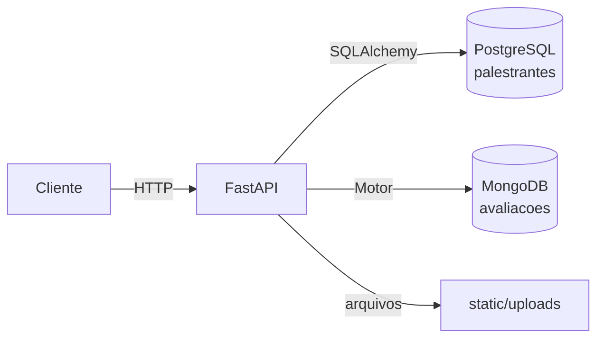

# API de Palestrantes — CRUD com SQL + NoSQL


[](https://github.com/LeoBuenoS/CRUD-sql-nosql/actions/workflows/ci.yml)

API REST para gerenciamento de palestrantes e avaliações de palestras, usando
**dois bancos por natureza do dado**: PostgreSQL para o dado estruturado do
palestrante e MongoDB para as avaliações (documentos flexíveis).

## O que este projeto demonstra

- **Modelagem de dados e escolha de tecnologia**: quando usar relacional vs. documento.
- **CRUD completo** com upload de imagem (arquivo em disco, referência no banco).
- **Integração entre dois bancos** no mesmo fluxo de request.
- **Camadas bem separadas** (routers → repositories → models/schemas → db).
- **Autenticação JWT** (bcrypt + OAuth2 password flow) protegendo a escrita.
- **Migrations versionadas** com Alembic (schema evolui sem `create_all`).
- **Agregação no MongoDB** para estatísticas das avaliações.
- **Busca e paginação** na listagem relacional.
- **Testes automatizados** com pytest e **CI** no GitHub Actions.
- **Containerização** da API (Dockerfile + docker compose).

## Arquitetura



**Por que dois bancos:** o palestrante tem estrutura fixa e exige integridade
(SKU do arquivo, campos obrigatórios) → **PostgreSQL**. As avaliações são
flexíveis, denormalizadas e de alto volume (autor, nota, comentário, tags) →
**MongoDB**. A imagem é binária: fica em disco, e o banco guarda só o nome do arquivo.

## Stack

Python 3.12 · FastAPI · JWT · SQLAlchemy · Alembic · Motor · PostgreSQL 15 · MongoDB 7 · Docker · pytest

## Como rodar

Pré-requisitos: Docker e um ambiente Python 3.12.

```bash
cp .env.example .env
make up        # sobe PostgreSQL + MongoDB em container
make install   # instala as dependências
make migrate   # cria o schema (alembic upgrade head)
make test      # roda os testes
make run       # API em http://localhost:8000/docs
```

Ou suba tudo (API + bancos) em container — as migrations rodam no start:

```bash
make docker-up  # http://localhost:8000/docs
```

A documentação interativa (Swagger) fica em `/docs`.

## Endpoints

Escrita (POST/PUT/DELETE) exige `Authorization: Bearer <token>`; leitura é pública.

| Método | Rota | Descrição |
|--------|------|-----------|
| GET | `/health` | Health check |
| POST | `/auth/registrar` | Cria usuário |
| POST | `/auth/token` | Login (OAuth2 password) → access token |
| GET | `/auth/eu` | Usuário do token 🔒 |
| GET | `/palestrantes` | Lista palestrantes (`?q=`, `?skip=`, `?limit=`) |
| POST | `/palestrantes` | Cria (multipart: dados + foto) 🔒 |
| GET | `/palestrantes/{id}` | Detalhe |
| PUT | `/palestrantes/{id}` | Edita (troca a foto e apaga a antiga) 🔒 |
| DELETE | `/palestrantes/{id}` | Remove (apaga a imagem junto) 🔒 |
| POST | `/avaliacoes` | Cria avaliação (valida o palestrante no Postgres) 🔒 |
| GET | `/avaliacoes/{palestrante_id}` | Lista avaliações do palestrante |
| GET | `/avaliacoes/{palestrante_id}/estatisticas` | Média, total e distribuição das notas |

## Autenticação

```bash
# 1. cria o usuário
curl -X POST localhost:8000/auth/registrar \
  -H 'Content-Type: application/json' \
  -d '{"email":"dev@exemplo.com","senha":"senha-super-secreta"}'

# 2. pega o token (form-urlencoded, padrão OAuth2)
curl -X POST localhost:8000/auth/token \
  -d 'username=dev@exemplo.com&password=senha-super-secreta'

# 3. usa nos endpoints de escrita
curl -X DELETE localhost:8000/palestrantes/1 -H "Authorization: Bearer $TOKEN"
```

A senha é guardada como hash **bcrypt** — o banco nunca vê o texto puro. O token
é um **JWT HS256** com `sub` (e-mail) e `exp`, assinado com `JWT_SECRET` (defina
no ambiente em produção). No `/docs`, o botão **Authorize** já funciona.

## Migrations

O schema do PostgreSQL é versionado com **Alembic** — a aplicação não cria
tabelas no boot.

```bash
make migrate                     # aplica as migrations pendentes
make migration m="nova coluna"   # gera uma a partir dos models
make downgrade                   # desfaz a última
```

`tests/test_migrations.py` roda o histórico completo em SQLite e compara o
schema resultante com os models: se alguém alterar um model e esquecer a
migration, o CI quebra.

As avaliações ficam no MongoDB e, por serem documentos flexíveis, não têm
schema versionado — a validação delas é feita pelos schemas Pydantic.

## Estrutura

```
app/
  main.py            # app FastAPI, monta rotas e arquivos estáticos
  core/config.py     # configuração via .env
  core/security.py   # bcrypt + emissão/leitura de JWT
  core/deps.py       # dependência de usuário autenticado
  db/                # conexões: postgres.py (SQLAlchemy), mongo.py (Motor)
  models/            # entidades relacionais
  schemas/           # contratos Pydantic
  repositories/      # acesso a dados (SQL e NoSQL)
  routers/           # endpoints HTTP
  services/upload.py # gravação/remoção de imagens
migrations/          # Alembic (histórico do schema relacional)
tests/               # pytest
Dockerfile           # imagem da API
.github/workflows/   # CI (black + flake8 + pytest)
```

## Testes

```bash
make test
```

A suíte roda sem nenhum banco externo: o lado SQL usa SQLite em memória e o lado
NoSQL usa um MongoDB falso (`mongomock-motor`), ambos injetados via
`app.dependency_overrides`. O mesmo comando roda no CI, junto de `black` e `flake8`.
