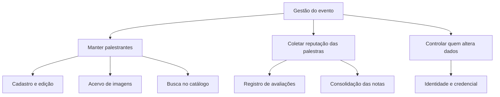
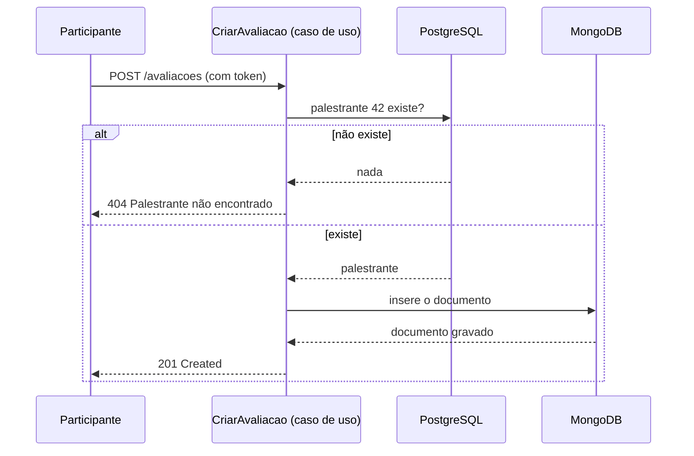

# 02 — Arquitetura de Negócio (Fase B)

## Atores

| Ator | Autenticado? | O que faz |
|------|--------------|-----------|
| Visitante | Não | Consulta palestrantes e avaliações |
| Organizador | Sim (JWT) | Mantém o cadastro de palestrantes |
| Participante | Sim (JWT) | Avalia palestras |

> O modelo atual tem **um único perfil autenticado**: qualquer usuário com token
> pode manter o cadastro e avaliar. A separação de papéis está registrada como
> lacuna em [06-lacunas-e-roadmap.md](06-lacunas-e-roadmap.md).

## Capacidades de negócio

## Processos

### P1 — Manter palestrante

1. O organizador se autentica e recebe um token.
2. Envia os dados do palestrante e, opcionalmente, uma foto.
3. A regra valida os campos obrigatórios e a experiência não negativa.
4. A foto é gravada no armazenamento; o cadastro guarda só o nome do arquivo.
5. Numa troca de foto, a nova é gravada **antes** de a antiga ser apagada — se a
   gravação falhar, nada é perdido.

Implementação: `app/application/use_cases/palestrantes.py`.

### P2 — Avaliar palestra

1. O participante autenticado envia autor, nota (1–5), comentário e tags.
2. A regra exige que o **palestrante exista** — é o ponto onde os dois bancos se
   encontram: a checagem acontece no PostgreSQL e a gravação no MongoDB.
3. A avaliação recebe o instante de criação e entra na coleção.

Implementação: `app/application/use_cases/avaliacoes.py`.

### P3 — Consultar reputação

Média, total e distribuição das notas de um palestrante. A contagem por nota sai
de uma agregação no MongoDB; a média é derivada na entidade
`EstatisticasDeAvaliacao`, onde a regra pode ser testada sem banco nenhum.

## Regras de negócio

| ID | Regra | Onde é garantida |
|----|-------|------------------|
| RN-01 | Nome, qualificação e local são obrigatórios e têm até 200 caracteres | `Palestrante.__post_init__` |
| RN-02 | Experiência não pode ser negativa | `Palestrante.__post_init__` |
| RN-03 | Nota fica entre 1 e 5 | `Avaliacao.__post_init__` |
| RN-04 | Avaliação exige palestrante existente | `CriarAvaliacao` |
| RN-05 | Só imagens são aceitas como foto | `ArmazenamentoLocal.salvar` |
| RN-06 | Remover palestrante remove a imagem junto | `RemoverPalestrante` |
| RN-07 | E-mail de usuário é único | `RegistrarUsuario` + índice único |
| RN-08 | Senha tem no mínimo 8 caracteres e é guardada como hash | `RegistrarUsuario` + `HashDeSenhaBcrypt` |
| RN-09 | Login errado não revela se o e-mail existe | `AutenticarUsuario` |
