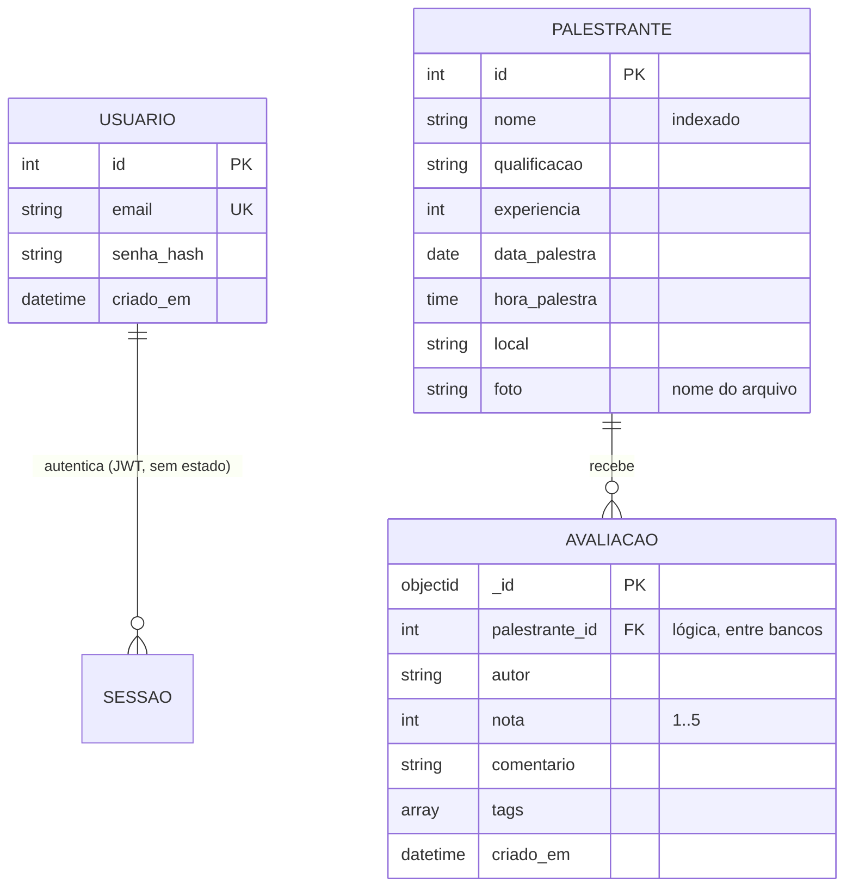

# 03 — Arquitetura de Dados (Fase C)

## Decisão central: dois bancos, por natureza do dado

| Característica | Palestrante | Avaliação |
|----------------|-------------|-----------|
| Estrutura | Fixa e conhecida | Flexível (tags, campos que podem surgir) |
| Volume | Dezenas a milhares | Cresce sem limite claro |
| Integridade | Obrigatória (unicidade, tipos) | Tolerante |
| Padrão de leitura | Busca e paginação | Por palestrante, e agregação de notas |
| **Banco** | **PostgreSQL** | **MongoDB** |

A imagem é binária e não entra em nenhum dos dois: fica no armazenamento de
arquivos e o banco guarda só o nome. Detalhes em
[ADR-0001](adr/0001-dois-bancos-por-natureza-do-dado.md) e
[ADR-0003](adr/0003-imagem-fora-do-banco.md).

## Entidades de negócio



A relação `PALESTRANTE → AVALIACAO` **não é uma foreign key**: ela cruza dois
bancos. Quem a garante é o caso de uso `CriarAvaliacao`, no momento da escrita.
O custo disso está assumido em [ADR-0001](adr/0001-dois-bancos-por-natureza-do-dado.md).

## Modelo relacional (PostgreSQL)

| Tabela | Colunas | Índices |
|--------|---------|---------|
| `palestrantes` | id, nome, qualificacao, experiencia, data_palestra, hora_palestra, local, foto | PK(id), `ix_palestrantes_nome` |
| `usuarios` | id, email, senha_hash, criado_em | PK(id), `ix_usuarios_email` (único) |
| `alembic_version` | num da revisão aplicada | controlado pelo Alembic |

`ix_palestrantes_nome` existe para servir a busca `GET /palestrantes?q=`; foi
adicionado em migration própria, para deixar o histórico legível.

## Modelo de documento (MongoDB)

Coleção `avaliacoes`:

```json
{
  "_id": "ObjectId(...)",
  "palestrante_id": 42,
  "autor": "Grace Hopper",
  "nota": 5,
  "comentario": "Ótima palestra",
  "tags": ["didática", "prática"],
  "criado_em": "2026-09-24T14:30:00Z"
}
```

O documento é **denormalizado de propósito**: a leitura de avaliações nunca
precisa de join. A validação de forma é feita na entrada (schema Pydantic) e no
domínio (`Avaliacao`), não por schema do banco.

Agregação usada nas estatísticas:

```javascript
[ { $match: { palestrante_id: 42 } },
  { $group: { _id: "$nota", quantidade: { $sum: 1 } } } ]
```

O banco devolve a **contagem por nota**; média e total são calculados na
entidade `EstatisticasDeAvaliacao` — regra de negócio testável sem Mongo.

## Ciclo de vida e governança do dado

| Dado | Criação | Alteração | Remoção |
|------|---------|-----------|---------|
| Palestrante | POST autenticado | PUT autenticado | DELETE autenticado; leva a imagem junto |
| Imagem | Upload junto do palestrante | Nova imagem grava antes de apagar a antiga | Junto do palestrante |
| Avaliação | POST autenticado, exige palestrante | Não há edição | Não há remoção (histórico preservado) |
| Usuário | POST público | — | — |

**Migrations** (`migrations/versions/`) são a fonte da verdade do schema
relacional. `tests/integration/test_migrations.py` roda o histórico inteiro e
compara o resultado com os models: model alterado sem migration quebra o CI.

**Lacunas conhecidas:** avaliações de um palestrante removido ficam órfãs no
Mongo, e não há LGPD/retenção definida. Ver
[06-lacunas-e-roadmap.md](06-lacunas-e-roadmap.md).
