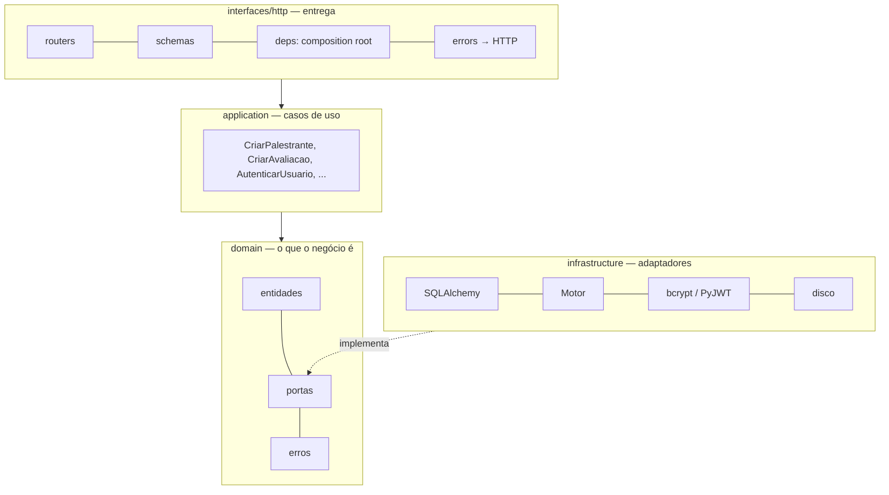
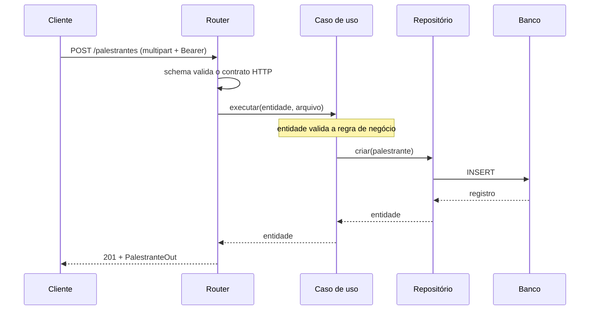

# 04 — Arquitetura de Aplicação (Fase C)

## Camadas

**A regra é uma só: a dependência aponta para dentro.** `domain` não importa
nada das outras camadas — nem FastAPI, nem SQLAlchemy, nem PyJWT. A
infraestrutura depende do domínio porque *implementa as portas dele*, e não o
contrário. É a inversão de dependência que torna o núcleo testável sem
infraestrutura.

| Camada | Pasta | Pode importar | Responsabilidade |
|--------|-------|---------------|------------------|
| Domínio | `app/domain/` | nada do projeto | Entidades, regras invariantes, portas, erros |
| Aplicação | `app/application/` | `domain` | Orquestra as regras em operações de negócio |
| Interface | `app/interfaces/` | `application`, `domain`, `infrastructure` (só em `deps.py`) | Traduz HTTP ↔ caso de uso |
| Infraestrutura | `app/infrastructure/` | `domain` | Fala com Postgres, Mongo, disco, bcrypt, JWT |

## Portas e adaptadores

| Porta (`app/domain/ports/`) | Adaptador em produção | Adaptador nos testes |
|------------------------------|-----------------------|----------------------|
| `PalestranteRepositorio` | `PalestranteRepositorioSQLAlchemy` | `PalestranteRepositorioFake` / SQLite |
| `AvaliacaoRepositorio` | `AvaliacaoRepositorioMongo` | `AvaliacaoRepositorioFake` / mongomock |
| `UsuarioRepositorio` | `UsuarioRepositorioSQLAlchemy` | `UsuarioRepositorioFake` / SQLite |
| `ArmazenamentoDeArquivos` | `ArmazenamentoLocal` (disco) | `ArmazenamentoFake` (memória) |
| `HashDeSenha` | `HashDeSenhaBcrypt` | `HashDeSenhaFake` |
| `EmissorDeToken` | `EmissorDeTokenJWT` | `EmissorDeTokenFake` |

As portas são `typing.Protocol`: o adaptador não herda de nada, basta ter a
assinatura. Trocar disco por S3 é escrever um `ArmazenamentoS3` e mudar **uma
linha** em `app/interfaces/http/deps.py`.

## Componentes por caso de uso

| Caso de uso | Portas que usa | Endpoint |
|-------------|----------------|----------|
| `ListarPalestrantes` | PalestranteRepositorio | `GET /palestrantes` |
| `ObterPalestrante` | PalestranteRepositorio | `GET /palestrantes/{id}` |
| `CriarPalestrante` | PalestranteRepositorio, Armazenamento | `POST /palestrantes` 🔒 |
| `EditarPalestrante` | PalestranteRepositorio, Armazenamento | `PUT /palestrantes/{id}` 🔒 |
| `RemoverPalestrante` | PalestranteRepositorio, Armazenamento | `DELETE /palestrantes/{id}` 🔒 |
| `CriarAvaliacao` | PalestranteRepositorio, AvaliacaoRepositorio | `POST /avaliacoes` 🔒 |
| `ListarAvaliacoes` | AvaliacaoRepositorio | `GET /avaliacoes/{id}` |
| `ObterEstatisticas` | PalestranteRepositorio, AvaliacaoRepositorio | `GET /avaliacoes/{id}/estatisticas` |
| `RegistrarUsuario` | UsuarioRepositorio, HashDeSenha | `POST /auth/registrar` |
| `AutenticarUsuario` | UsuarioRepositorio, HashDeSenha, EmissorDeToken | `POST /auth/token` |
| `ObterUsuarioDoToken` | UsuarioRepositorio, EmissorDeToken | dependência dos endpoints 🔒 |

## Fluxo de um request

Erro de domínio sobe como exceção (`RecursoNaoEncontrado`, `DadosInvalidos`,
`ConflitoDeDados`, `CredenciaisInvalidas`) e vira status HTTP num único lugar:
`app/interfaces/http/errors.py`. Nenhum caso de uso conhece código HTTP.

## Estratégia de testes por camada

| Camada | Teste | O que prova | Custo |
|--------|-------|-------------|-------|
| Domínio | `tests/unit/test_entidades.py` | Regras invariantes | Milissegundos |
| Aplicação | `tests/unit/test_casos_de_uso_*.py` | Orquestração, com portas falsas | Milissegundos |
| Interface | `tests/integration/*_api.py` | Contrato HTTP, status, autenticação | Segundos, sem serviço externo |
| Infraestrutura | `tests/db/` | ILIKE, `server_default`, pipeline de agregação, migrations | Exige os bancos (job próprio no CI) |

A pirâmide é intencional: o que é barato roda sempre; o que exige banco roda num
job separado, para não travar o ciclo de feedback.
