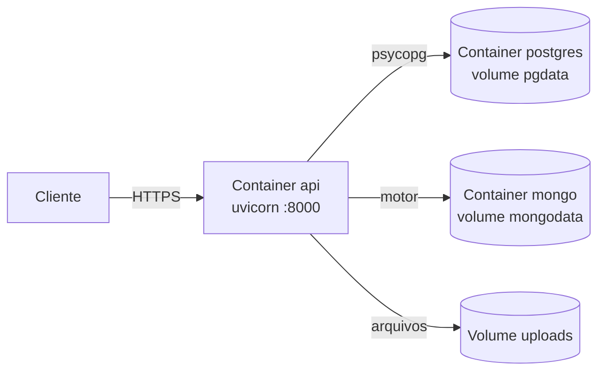
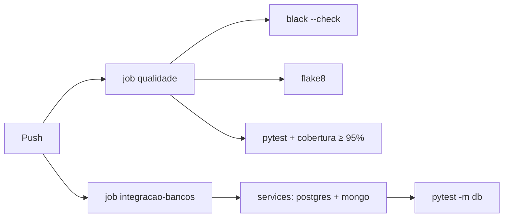

# 05 — Arquitetura de Tecnologia (Fase D)

## Stack

| Função | Tecnologia | Por quê |
|--------|------------|---------|
| Linguagem | Python 3.12 | Tipagem moderna (`str | None`), dataclasses |
| API | FastAPI | Validação declarativa, OpenAPI e DI de fábrica |
| ORM | SQLAlchemy 2.0 | Estilo tipado (`Mapped[...]`) |
| Migrations | Alembic | Histórico versionado do schema |
| Driver NoSQL | Motor | MongoDB assíncrono |
| Banco relacional | PostgreSQL 15 | Integridade, ILIKE, índices |
| Banco de documento | MongoDB 7 | Documento flexível e agregação |
| Autenticação | PyJWT + bcrypt | Padrão de mercado, sem estado no servidor |
| Testes | pytest, pytest-asyncio, pytest-cov, mongomock-motor | Cobrem da regra pura ao HTTP |
| Qualidade | black, flake8 | Formatação e lint sem discussão |
| Empacotamento | Docker, docker compose | Mesmo ambiente em qualquer máquina |
| CI | GitHub Actions | Dois jobs: qualidade e integração com bancos |

## Implantação

O container da API roda `alembic upgrade head` **antes** do uvicorn: o schema
nunca fica atrás do código. O `depends_on` com `condition: service_healthy`
garante que o Postgres está pronto antes da migration rodar.

O diretório de uploads é um **volume** — se fosse camada do container, as
imagens sumiriam a cada deploy. É também a peça que hoje impede escalar a API
horizontalmente sem antes migrar para armazenamento de objetos
(ver [ADR-0003](adr/0003-imagem-fora-do-banco.md)).

## Configuração por ambiente

Tudo vem de variável de ambiente, com default só para desenvolvimento
(`app/infrastructure/config.py`).

| Variável | Default | Observação |
|----------|---------|------------|
| `POSTGRES_HOST` / `PORT` / `DB` / `USER` / `PASSWORD` | localhost / 5432 / catalog / app / change-me | No compose, o host é `postgres` |
| `MONGO_URI`, `MONGO_DB` | mongodb://localhost:27017, catalog | No compose, `mongodb://mongo:27017` |
| `JWT_SECRET` | dev-secret-change-me | **Obrigatório trocar em produção** |
| `JWT_EXPIRE_MINUTES` | 60 | Vida do access token |
| `BCRYPT_ROUNDS` | 12 | Os testes usam 4, por velocidade |
| `UPLOAD_DIR` | static/uploads | Caminho do armazenamento local |

## Ambientes

| Ambiente | Como sobe | Bancos |
|----------|-----------|--------|
| Desenvolvimento | `make up && make migrate && make run` | Containers locais |
| Teste (rápido) | `make test` | Nenhum: SQLite em memória + Mongo falso |
| Teste (fiel) | `make test-db` | PostgreSQL e MongoDB reais |
| Container | `make docker-up` | Tudo em compose |

## Pipeline de qualidade

O job `integracao-bancos` sobe PostgreSQL e MongoDB como *services* do Actions e
roda só os testes marcados `db` — inclusive as migrations aplicadas contra um
PostgreSQL de verdade, o que o SQLite dos testes rápidos não conseguiria provar.

## Segurança

| Aspecto | Estado atual |
|---------|--------------|
| Senha | bcrypt, custo 12; texto puro nunca persistido |
| Token | JWT HS256, expiração curta, sem estado no servidor |
| Leitura | Pública, por decisão de produto |
| Escrita | Exige Bearer token válido |
| Upload | Extensão restrita a imagens; nome gerado por UUID, o do cliente é descartado |
| Segredos | Fora do repositório, via ambiente |
| Enumeração de usuário | Login responde igual para e-mail inexistente e senha errada |

Pendências de segurança (refresh token, rate limiting, verificação de conteúdo
do upload) estão em [06-lacunas-e-roadmap.md](06-lacunas-e-roadmap.md).
